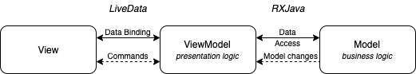
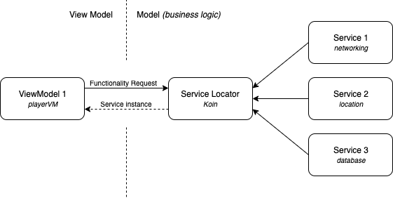

# Android MVVM
MVVM stands for Model, View, ViewModel.

  - Model: This holds the data of the application. It cannot directly talk to the View. Generally, it’s recommended to expose the data to the ViewModel through Observables.
  - View: It represents the UI of the application devoid of any Application Logic. It observes the ViewModel.
  - ViewModel: It acts as a link between the Model and the View. It’s responsible for transforming the data from the Model. It provides data streams to the View. It also uses hooks or callbacks to update the View. It’ll ask for the data from the Model.

# Model in closeup

  - Service Locator: Every user of a service has a dependency to the locator. The locator can hide dependencies to other implementations, but you do need to see the locator.
  - Serivce/Microservice: An architectural style that structures an application as a collection of services. Highly maintainable and testable. Loosely coupled. Organized around business capabilities.
